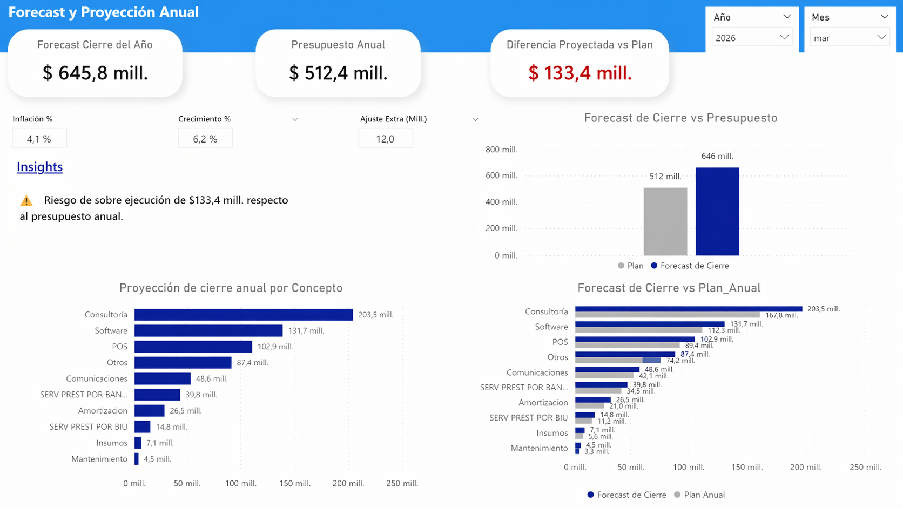

📊 Dashboard Financiero de TI

🎯 Objetivo
Brindar visibilidad sobre la ejecución del presupuesto de TI, permitiendo analizar desvíos, entender la evolución del gasto y anticipar el cierre financiero del año.

🧠 Contexto de negocio
Las áreas de tecnología suelen manejar presupuestos elevados, pero con visibilidad limitada sobre:
- Desvíos respecto al plan
- Evolución del gasto en el tiempo
- Impacto de proveedores y categorías clave
- Proyección de cierre anual

Este dashboard fue diseñado para mejorar el control financiero y facilitar la toma de decisiones basada en datos.

📊 Contenido del Dashboard

🔹 Hoja 1 — Análisis de gasto actual
- Visualización del gasto real de TI
- Filtros por mes
- Identificación de conceptos con mayor desvío
- Seguimiento de gasto acumulado en:
  - Activaciones
  - Cloud
  - Licencias

🔹 Hoja 2 — Seguimiento vs Plan
- Comparación del gasto acumulado anual vs presupuesto
- Identificación de desvíos
- Análisis de cumplimiento del plan financiero

🔹 Hoja 3 — Análisis por proveedor
- Visualización del gasto segmentado por proveedor
- Dos enfoques principales:
  - Servicios de consultoría
  - Licencias y servicios cloud
- Identificación de principales drivers de costo

🔹 Hoja 4 — Forecast y proyección
- Estimación de cierre de año
- Proyección basada en tendencias actuales
- Identificación temprana de posibles desvíos futuros

📷 Vista previa

![Overview]images/Gasto mensual-anual y por proveed.png

💡 Valor generado
Este dashboard permite:
- Detectar desvíos de forma temprana  
- Mejorar el control del gasto  
- Entender la composición del costo de TI  
- Anticipar resultados financieros  
- Tomar decisiones basadas en datos  

🔒 Nota sobre los datos
Los datos utilizados han sido anonimizados y/o modificados para preservar la confidencialidad de la información.

🛠 Herramientas utilizadas
- Power BI  
- Excel  

🚀 Sobre mí
Profesional de finanzas enfocado en analítica, automatización y generación de insights para la toma de decisiones.
